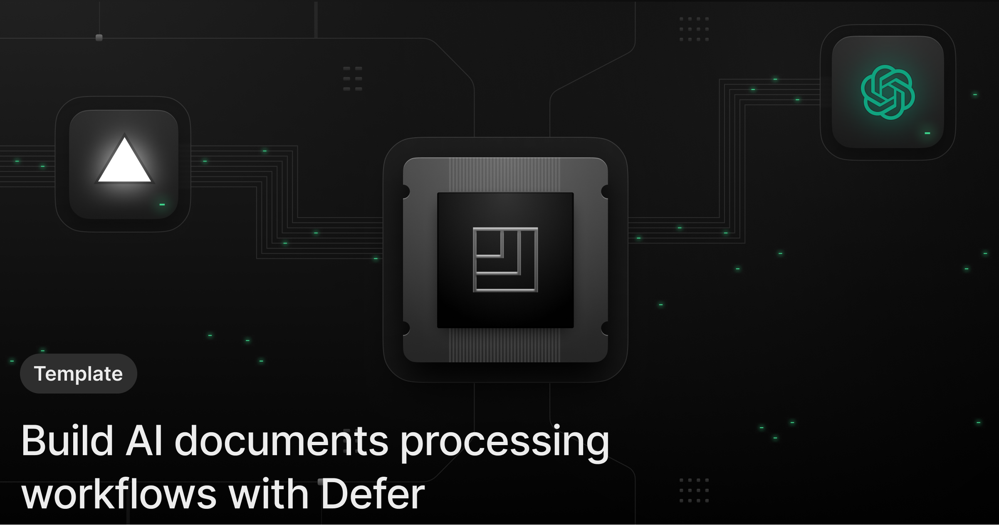
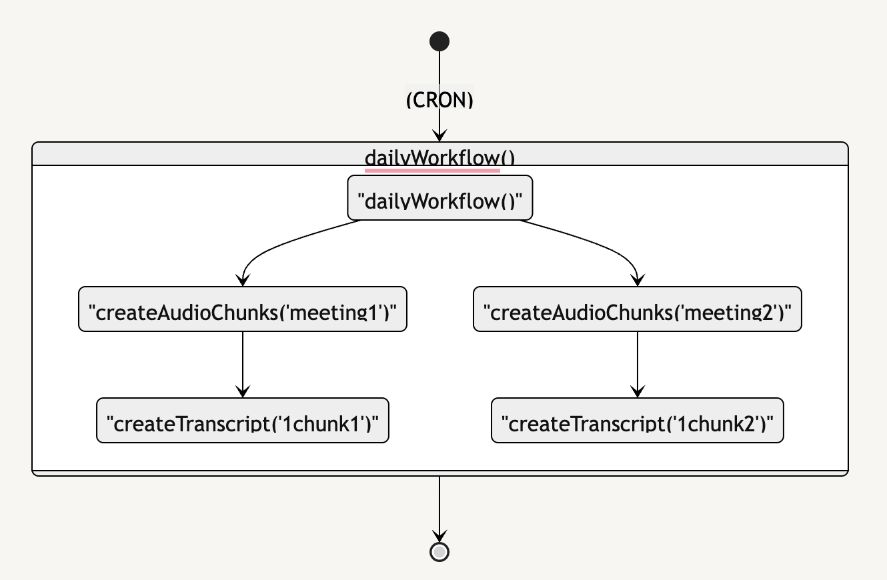

<h1 align="center">Next.js x Defer x OpenAI Whisper</h1>

<p align="center">
 Process large video files with OpenAI Whisper with Defer
</p>

<p align="center">
    <a href="https://docs.defer.run/">Documentation</a>
    <span>&nbsp;·&nbsp;</span>
    <a href="https://www.defer.run/blog">Blog</a>
    <span>&nbsp;·&nbsp;</span>
    <a href="https://discord.gg/x2v84Vqsk6">Community</a>
    <span>&nbsp;·&nbsp;</span>
    <a href="https://github.com/defer-run/defer.client/discussions/categories/roadmap">Roadmap / RFCs</a>
</p>
<br/>

<br />

## Overview

Processing documents with AI involves compute-intensive and long-running processes dealing with multiple possible failures along the way.

This demo showcases how to process video meetings to extract text-to-speech using OpenAI Whisper.

Defer workflow pattern helps overcome OpenAI Whisper 20MB file upload limit and deal with the parallel processing of the meeting video file:



<br />

## Deploy to Vercel

1. First, click on the following button will fork this demo repository and deploy it on your Vercel account: [](https://vercel.com/new/clone?repository-url=https%3A%2F%2Fgithub.com%2Fdefer-run%2Fdefer.demo%2Ftree%2Fmaster%2Fnextjs%2Fopenai-files-workflows-template%2F&project-name=nextjs-with-defer-openai&repository-name=nextjs-with-defer-openai&demo-title=nextjs-with-defer-openai&demo-description=Leverage%20Defer%20using%20GitHub%20data%20as%20a%20prompt%20for%20OpenAI%20completion%20API.&demo-url=https%3A%2F%2Fnextjs-with-defer-openai.vercel.app%2F&external-id=https%3A%2F%2Fgithub.com%2Fdefer-run%2Fdefer.demo%2Ftree%2Fmaster%2Fnextjs%2Fopenai-files-workflows-template%2F&demo-image=https%3A%2F%2Fraw.githubusercontent.com%2Fdefer-run%2Fdefer.demo%2Fmaster%2Fnextjs%2Fopenai-files-workflows-template%2Fapp%2Fog_image.png&integration-ids=)

2. Once deployed on Vercel, go to the [Defer](https://console.defer.run/) Console to create an account](https://console.defer.run/).

3. Then, create a new Defer application by selecting your GitHub repository created from this template.

4. Finally, go to the [Defer Vercel Integration page](https://vercel.com/integrations/defer) (_Click "Add Integration"_) to connect your Vercel application with your Defer ones.

5. You are good to go! The tasks will now run on Defer, triggered from your Vercel demo application 🚀

<br />

## Clone and run locally

1. Create a Next.js app using this template with the `npx command`:

   ```bash
   npx create-next-app -e https://github.com/defer-run/defer.demo/tree/master/nextjs/openai-files-workflows-template
   ```

2. Use `cd` to change into the app's directory

   ```bash
   cd name-of-new-app
   ```

3. You can now run the Next.js local development server:

   ```bash
   npm run dev
   ```

   The demo application should now be running on [localhost:3000](http://localhost:3000/).

> Check out [the docs for Local Development](https://www.defer.run/docs/get-started/development-testing#local-development).

<br />

> Follow our [Vercel Integration guide](https://www.defer.run/docs/integrations/vercel) to deploy your new repository to Defer and Vecerl without using the "Deploy to Vercel" button

<br />

## OpenAI API key

Get your OPENAI_API_KEY from: https://platform.openai.com/api-keys
